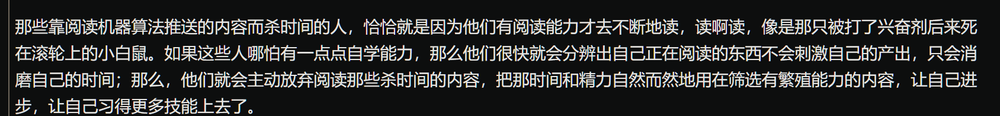

# 什么是自学

去学会自学，而不是仅仅去学会学习

## 自学的作用

> 在这个时代去缓解自我的焦虑情绪、
>
>  若是在一个以肉眼可见的方式变化着的环境里生存，却心知肚明自己已然原地踏步许久，自己正在被这个时代甩在身后，谁能不焦虑呢？

## 自学的现状

> 至少百分之99的人一辈子学不会如何自学
>
>  更可怕的是，他们学的那些东西中，绝大多数终其一生只有一个用处：考试。于是，考试过后，那些东西就 “考过即弃” 了…… 不得不承认，应试教育的确是磨灭自学能力的最有效方法。

### 没有不学习的人

此类人群分为

不学无术：学习如何去投机取巧，天天琢磨如何更好去投机取巧

最倒霉的人："认真学习了"却落得个越来越焦虑的后果，而且经常斥责其他人”贩卖焦虑”

**但是，别人无法贩卖给你焦虑，是你在为自己不断积累越来越多的焦虑**

## 自学能力强的人现状

不会因为学习以及学习的过程而焦虑，这是重大差别

生活质量就是这样一点一点被消磨掉的——最消耗生活质量的东西就是焦虑

这本书的作用就是，让你明白，焦虑没用的，**逐步体会到那积累的作用，甚至最后还能感觉到更多积累带来的加速度…… 到那时候，焦虑就是 “别人的事情” 了。**

# 如何看待自学

没有任何污染的纯天然领域，任何老生常谈都是至理名言

# 为什么一定要掌握自学能力

没有自学能力的人没有未来

不要畏惧时间，因为这个时间可能本来就会被浪费

> 磨练出自学能力的好处在于，无论这世界需要我们学什么的时候，我们都可以主动去学，并且还是马上开始 —— 不需要等别人教、等别人带。

# 为什么是编程

计算机是教育资源一切人都平等的地方，一切都靠自学，什么技术，能力全部都要靠自我的学习，只有自己教自己

后来，人们反应过来了，不识英文，也是文盲，因为科学文献的主导语言是英文，读不懂英文，什么都吃不上热乎的；等菜好不容易端上来了吧，早就凉了不说，味道都常常会变……

## 编程的问题

知识点不是线性的

自学编程在这方面的好处在于，在自学的过程中，其实你相当于过了一遍 “模拟人生” —— 于是，面对同样的 “*过早引用*”，你不会觉得那么莫名其妙，你有一套你早已在 “模拟人生” 中练就的方法论去应对。

# 只靠阅读习得新技能

> - 有自学能力的人，选择阅读 “有繁殖能力” 的内容；
> - 没有自学能力的人，阅读只是为了消磨时光……

